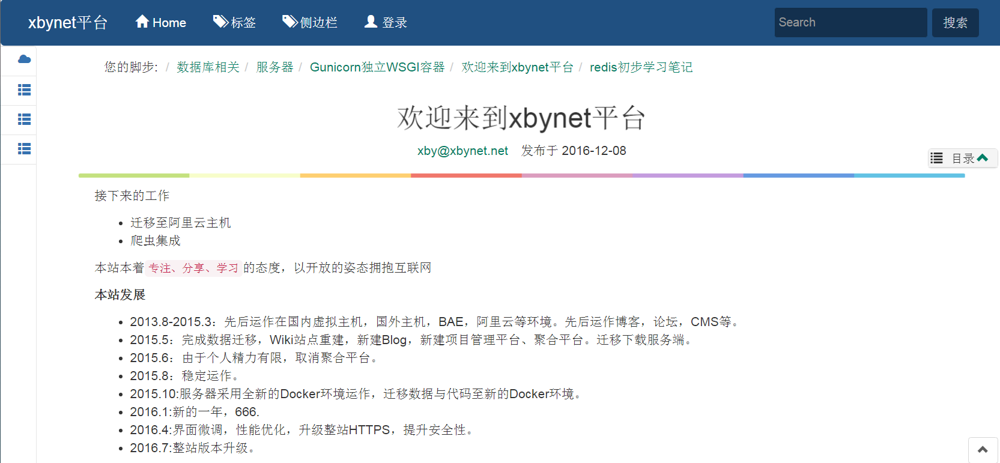

<<<<<<< HEAD
# mdwiki
markdown wiki by python with flask 



采用Python+Flask+Redis+SQLite开发（看后面选型介绍）

# 功能特性：

首先它的定位是一款wiki系统，旨在作为个人或小团队的知识库管理系统。

- markdown编辑器支持图片粘贴与拖拽上传,支持实时预览。
- wiki检索
- 图片管理
- 备份管理
- 标签
- 文章编辑定时独占锁定
- IP、session两层登录次数等限制及登录验证码。
- 通过fabric支持自动化分发部署
- 不开放注册，仅限个人或小团体使用。
- 提供dokuwiki to markdown转换脚本
- 其他

# 安装
目前仅支持python3,建议Python3.4及以上

## 生产环境安装:
推荐采用SuperVisor+Nginx+Gunicorn+Virtualenv的组合。以ubuntu为例：(你也可以参考conf/目录下的配置文件):

基础包安装

```
sudo apt-get install supervisor -y
sudo apt-get install build-essential python-software-properties software-properties-common -y
sudo add-apt-repository ppa:nginx/stable 
sudo add-apt-repository -y ppa:rwky/redis
sudo apt-get update
sudo apt-get install nginx  -y
sudo apt-get install -y redis-server
sudo apt-get install python3-pip -y
sudo apt-get install libssl-dev libffi-dev python-dev python3-dev -y
sudo apt-get install libevent-dev libssl-dev libffi-dev libsasl2-dev libpq-dev  libxml2-dev libxslt1-dev libldap2-dev  -y
```

配置pip源为豆瓣源：
vim ~/.pip/pip.conf

```
[global]
index-url = https://pypi.douban.com/simple #豆瓣源，可以换成其他的源
disable-pip-version-check = true          #取消pip版本检查，排除每次都报最新的pip
timeout = 120
```

配置virtualenv:

```
sudo pip3 install virtualenv
mkdir venv && cd venv 
virtualenv mdwiki
source mdwiki/bin/activate
pip3 install gunicorn
```

配置相关配置(具体配置文件请参考conf/目录下对应文件)

```
sudo vim  mdwiki/gunicorn.conf.py
sudo vim /etc/supervisor/conf.d/default.conf
sudo vim /etc/nginx/conf.d/default.conf
```

设置开机自启

```
sudo vim /etc/rc.local
/usr/bin/supervisord -c /etc/supervisor/supervisord.conf
```

生产环境部署：
在客户机安装NodeJS及gulp，客户机安装fabric

```
pip3 install fabric
python run.py create_db
python run.py init_admin  -n yourname -e youremail -p yourpassword 
```

配置好conf目录下的fabric.py脚本。然后在项目目录下执行：

```
gulp product
fab -f conf/fabric.py deploy
```

即可实现自动部署。以后每次即只要执行这两条命令就可部署至远程。

如果你需要二次开发，或者只是想本地进行简单测试：本地开发环境安装

## 本地开发环境安装:

前端配置的话你需要安装node.js，及gulp。

```
    npm init
    #用conf/gulp-version-number替换 node_moules/gulp-version-number 
    gulp dev
    gulp watch
```

python配置你需要

```
pip3 install -r requirements.txt
python run.py create_db
python run.py init_admin  -n yourname -e youremail -p yourpassword 
python run.py run
```

# 使用

- 新建页面 /pages/< your_page_name>
- 侧边栏模式 # /pages/db:数据库:cloud 分别代表链接，名称，图标


一些说明后续会细化及补充

# 目前尚待完善的地方：

- 不支持主题化
- 不支持插件化
- 图片管理没有进行分类
- 菜单不支持自定义
- 没有集成爬虫功能
- 性能与缓存需要进行优化
- 代码将在后续大版本中重构


# 技术选型
----
Python3 or 2.7？

作为新手，Python3义不容辞.为什么？就为了原生支持UTF-8.(开玩笑),因为Python3代表了Python的未来，而且越来越多的库已经迁移到了Python3，没有什么理由不选择它。

IDE选择：

pycharm+sublime text3，这个也没必要解释了。

Web框架选择:

Flask(为什么？只会这个，而且大家都说好。)

服务器选择:

nginx+gunicorn这应该是比较流行的方案吧，也不做过多解释。

数据库选择：
SQLite+Redis

部署方式:

- Supervisor管理Nginx+gunicorn
- Fabric远程发布

浏览器兼容性：
不考虑万恶的IE

后端库选择:

- Flask Web框架
- Jinja2 flask官方指定模板引擎
- SQLAlchemy ORM框架
- Celery任务调度
- whoosh+jieba:信息检索
- oss2：阿里云oss云存储SDK
- redis-py：Redis的python连接客户端
- Markdown：后端markdown解析
- pillow:验证码生成

Flask插件如下：

- Flask-Babel国际化插件
- Flask-Script命令行插件
- Flask-sqlalchemy ORM插件集成
- Flask-migrate数据迁移插件
- Flask-WTF表单插件
- flask-login插件
- flask-Principal权限管理
- Flask-Security插件
- flask-mail插件
- Flask-cache缓存插件
- flask-testing测试插件
- Flask-Moment本地化时间日期


前端库选择：

gulp-前端资源管理与打包,可以参考我的一篇文章:[gulp组织小型项目小记][1]

- animate.css特效
- bootstrap 都懂的
- jQuery
- jQuery插件：validate,fancyBox,jQuery-ui
- simplemde markdown编辑器
- webuploader 百度开源的文件上传组件
- toastr一款漂亮的通知组件
- taggle.js 标签输入组件
- highlight.js代码高亮


  [1]: https://segmentfault.com/a/1190000007613571


# 关于作者

[专栏地址](https://segmentfault.com/blog/xbynet)

email：xbynet@outlook.com
=======
# catlib
猫咪图书馆，以wiki的组织形式存放📒markdwon数据信息，涵盖生活，政治，经济，文化，占星，高科技等方方面面。
>>>>>>> 2e0c72d054890dce851b38155fb4eee30492604c
